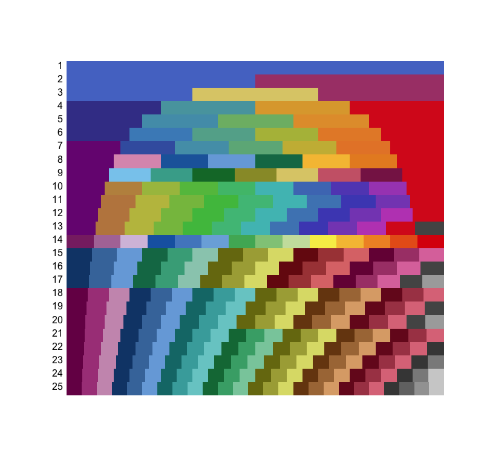

# remcolor
A package for generating color palettes and gradients in R. These color schemes are taken in large part from [Paul Tol's SRON technical note](https://personal.sron.nl/~pault/colourschemes.pdf)

Below are each of the schemes for `palette.rainbow`, as shown using `show_palettes`.

